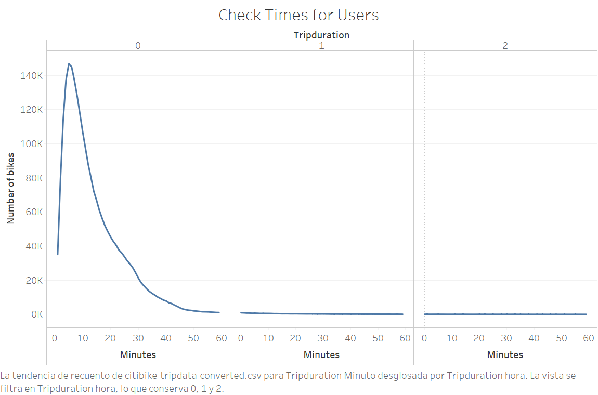
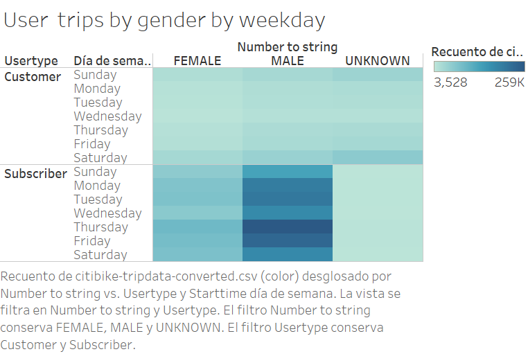
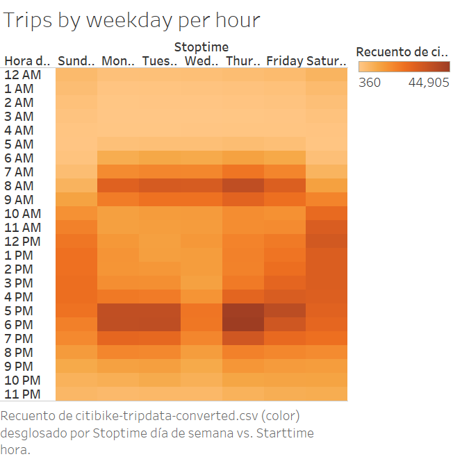
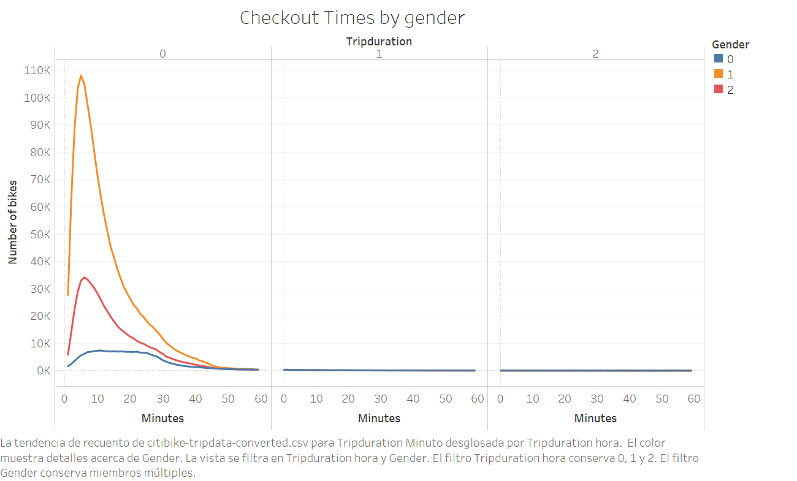

# bikes

Click here to view the dashboard on Tableau: [link to dashboard](https://public.tableau.com/app/profile/jos.miguel.guerra/viz/NYCCitiBikeAnalysis_16242579763900/Historia1)

## Overview

The goal of this analysis is to create a proposal that helps investors to support a bike-sharing program in Des Moines, Iowa. From the data set that was given to us, we were able to create charts to see average biking durations trends and the correlation between gender and popular biking times.

### Visualisations
length of time that bikes are checked out for all riders and genders, number of bike trips for all riders and genders for every hour of each day of the week, number of bike trips for every type of user and gender for each day of the week.

.png)

